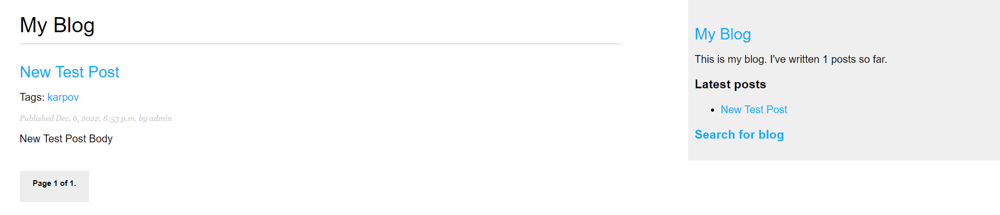
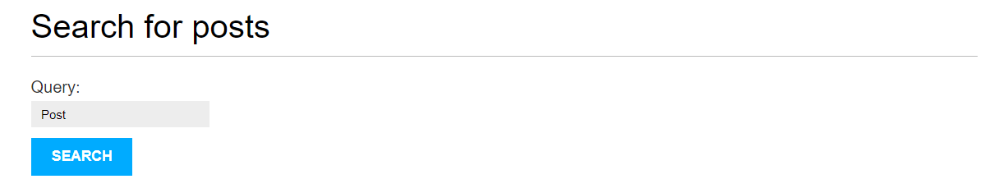
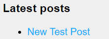
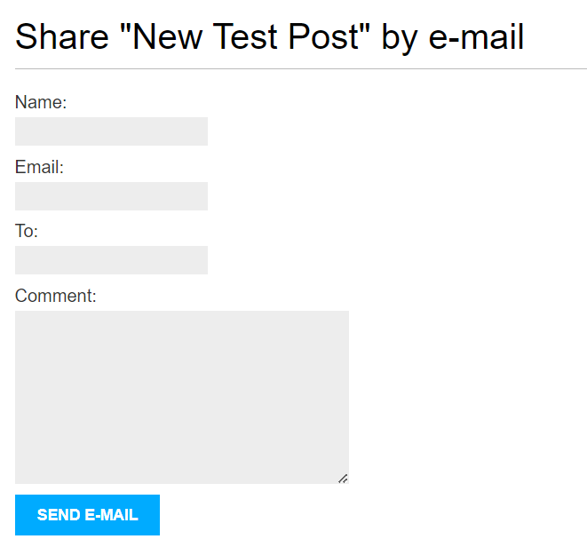
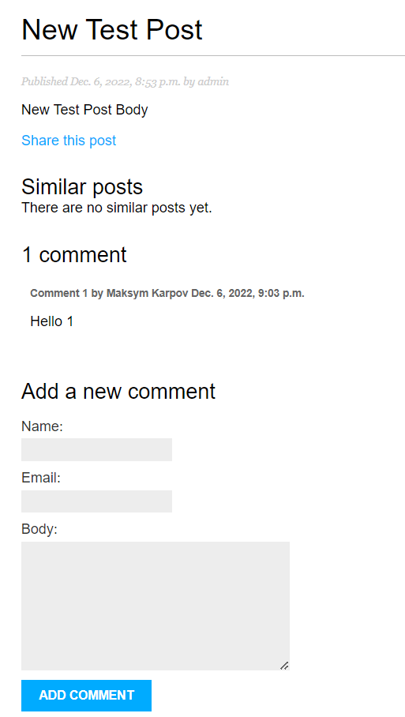

# Blog App

Blog App is an open source project built on Django. It's focused on user
experience, and offers ability to easily operate with posts.

### Features
* Ability to search posts  
    
* Display the latest posts on sidebar  
    
* Share post with friends  
    
* Comment any post  
    